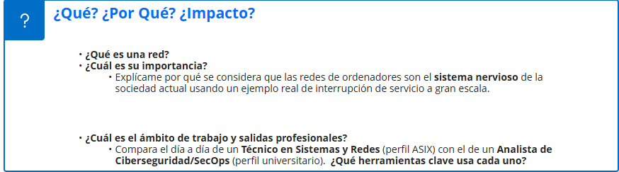

# PREGUNTAS SOBRE LA RED

<figure><figcaption></figcaption></figure>

* Una red es una infraestructura con la que los usuarios que la utilizan, pueden comunicarse con otras personas con las que no están localmente&#x20;
* La importancia de una red es importante, ya que actualmente, estamos en una sociedad en la que los usuarios estamos conectados todos virtualmente y toda la información que tenemos hoy en dia esta digitalizada y sin red, no podriamos acceder a ella, hubo un dia que se fue la luz en toda españa, y todo el mundo no podia acceder a su dinero durante todo el dia ni tampoco informarse
*

    | Aspecto                   | Técnico en Sistemas y Redes (ASIX)                                                                                               | Analista de Ciberseguridad / SecOps                                                                                                            |
    | ------------------------- | -------------------------------------------------------------------------------------------------------------------------------- | ---------------------------------------------------------------------------------------------------------------------------------------------- |
    | **Ámbito de trabajo**     | Instalación, configuración y mantenimiento de sistemas informáticos, servidores y redes.                                         | Protección de sistemas y redes, detección de amenazas y respuesta ante incidentes de seguridad.                                                |
    | **Funciones principales** | Administrar servidores, configurar redes, gestionar usuarios, realizar copias de seguridad y solucionar problemas técnicos.      | Monitorizar eventos de seguridad, investigar alertas, detectar ataques, analizar malware y responder a incidentes.                             |
    | **Salidas profesionales** | Técnico de sistemas, administrador de redes, administrador de sistemas, técnico de soporte o responsable de infraestructura.     | Analista SOC, analista de ciberseguridad, especialista en respuesta a incidentes, analista de amenazas o técnico de seguridad.                 |
    | **Herramientas clave**    | Windows Server, Linux, Active Directory, VMware/VirtualBox, Cisco, Docker, herramientas de monitorización y copias de seguridad. | SIEM como Splunk, Wazuh o Microsoft Sentinel, Wireshark, herramientas EDR/XDR, Nmap, Kali Linux y plataformas de análisis de vulnerabilidades. |

<figure><figcaption></figcaption></figure>

* **¿Cuáles son los fundamentos físicos y lógicos a considerar?**

Fundamentos físicos:

1. Medios de transmisión y naturaleza de la señal

\- Guiados: Cables y fibra óptica (voltaje/fotones)- No guiados: ondas de radio, microondas o infrarrojo (ondas electromagnéticas)

1. Ancho de banda físico y velocidad:

La cantidad máxima de datos que puede transmitir un medio

1. Perturbaciones de la transmisión:

\- Atenuación- Ruido e interferenciaFundamentos lógicos:

1. Modelos de referencia; OSI, TCP/IP
2. Protocolos de comunicación; IP, TCP, UDP, HTTP/HTTPS
3. Conmutación y Enrutamiento

* **¿Qué dispositivos de red tenemos que aprender a configurar? ¿Qué son los protocolos? ¿Cuál es su uso?**

Los equipos clave que debes dominar en redes informáticas se dividen entre el hardware que gestiona el tráfico y las reglas virtuales (protocolos) que hacen posible la comunicación.Los dispositivos de red a aprender:

* Router (Enrutador)
* Switch (Conmutador)
* Firewall (Cortafuegos)
* Punto de Acceso Inalámbrico (WAP / AP)
* Módem

Un protocolo es un conjunto de reglas definidas que determinan cómo se codifican, transmiten, reciben e interpretan los datos entre dos o más equipos de una red.Principales usos de los protocolos:

* IP: Se encarga de direccionar y enviar los paquetes de datos a su destino.
* HTTP / HTTPS: Permite la transferencia de páginas web en el navegador.
* TC&#x50;**:** Garantiza que los datos lleguen completos y en orden sin errores.
* DNS: Traduce las direcciones IP a nombres de dominios fáciles de leer.

<figure><figcaption></figcaption></figure>

* Software defined networking (denominado SDN) es una arquitectura de red, con la que se puede configurar y gestionar las redes a partir de un software, sin ningun tipo de equipo electronico fisico
* Network Functions Virtualization (tambien llamado NFV o Virtualizacion de Funciones Red) es una tecnología que reemplaza los dispositivos de hardware físico de red (como enrutadores, cortafuegos y equilibradores de carga) por software que se ejecuta en máquinas virtuales
* La nuve (o CLOUD como le conocemos en el mundillo de la informática) son servidores o discos duros donde podemos almacenar datos, imagenes, videos o diversa informacion y podemos hacerlos en AWS o AZURE, que son las nuves de Amazon o Windows
* Los contenedores son paquetes de informacion donde podemos guardar imagenes, url, ficheros o cualquier cosa que podamos digitalizar
* La diferencia que hay entre un router tradicional y usar un SDN es que el router es hardware y el SDN es software, es decir, que el router es fisico y SDN es digital, la ventaja que tiene el router a diferencia de SDN, es que es fisico y se administra todo desde el hardware y da pulsos magneticos a los dispositivos para conectarlos a una red wifi o mediante cable a puertos RJ45 y si reseteas el dispositivo donde tienes el SDN, lo pierdes, con el router no y las configuraciones se guardan dentro del router y no del ordenador. Y la ventaja del SDN frente al router, es que no necesitas ningun dispositivo fisico y no necesitas que el dispositivo este cerca del dispositivo anfitrion para tener la maxima red disponible
* El alcance de la IA en las redes hoy en dia es masivo, cualquier persona hoy en dia, la ha utilizado o a escuchado hablar de ella, hoy en dia la ia aprende con el computer learning, es decir la ia aprende a partir de patrones que les envian los usuarios y con informacion con la que puede sacar en interenet, hoy en dia la ia es capaz de detectar las anomalias gracias a lo comentado anteriormente, ya que la ia aprende a base de patrones, y cuando ve algo que no va acorde de lo que a aprendido

<figure><figcaption></figcaption></figure>

