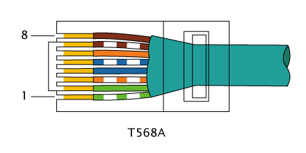

# UTP

Los cables que estamos utilizando en clase son cable de alimentacion de la compañia excel con las caracteristicas: cat6 y 23AWS, lo acompaña un cable de red de conector RJ45, cable cat6, de compañia excel.

Las normativas de estos cables de alimentacion y comunicacion son los siguientes:

**ALIMENTACION**

Reglamento Electrotécnico de Baja Tensión (REBT): Es una norma española que dice que los cables de alimentacion debe ser de baja tension, para que no hayan perturbaciones, grantizarl la seguridad y promover eficacias viables y fiables

Sección de cables: Pide que la potencia sea baja para que haya poca reaccion de fuego si hay cortocircuito

Clasificación CPR (Reacción al fuego): Es un tipo de marcaje que indica la reaccion del cable ante el fuego, tambien tiene marcas para acido, humo o gotas de particulas

**COMUNICACION**

Normativa ISO/IEC 11801: Es el estandar comun internacional, son para cables de cobre y de fibra optiva

Normativa EN50173: Son estandar para los cables simetricos

Normativa TIA/EIA-568: Es el tipo de cableado de los cables ethernet, tiene varios tipos de protocolo, para diferentes conexiones, se diferencian por el orden de los colores que se ultilizan en los cables.

Los cables del aula deberian de cumplir las normativas de segurad estipuladas, pero el problema es que los cables del aula, tienen las letras medio borradas y yo que estoy medio ciego no consigo verlos.

Hay varios tipos de cable UTP, estan los UTP, los FTP y los STP, aparte de juntar algunos protocolos entre ellos, como por ejemplo los SFTP.

Ahora describiremos cuales son cada uno y el uso mas comun que tienen:

UTP: se utiliza generalmente para redes domoticas, oficinas estandar, viviendas y conexiones de corta distancia.

FTP: se utiliza generalmente para entornos de oficina con alta concentración de cableado de datos, tiradas de cable paralelas a lineas de electricidad, o pequeñas industrias.

STP: se utiliza generalmente para Entornos industriales, centros de datos (Data Centers), zonas proximas a maquinaria pesada, motores electricos, centros de transformacion o tiradas en exterior.

S/FTP: se utiliza generalmente para Entornos industriales, centros de datos (Data Centers), zonas proximas a maquinaria pesada, motores electricos, centros de transformacion o tiradas en exterior.

Los protocolos que existen generalmente para conectar los dispositivos a la red son los TIA 568.

Hay mas de un tipo de protocolo TIA 568, que son el protocolo A, B, C, D y E, pero nosotros solo vamos a hablar del A y B&#x20;

El orden de los cables A son: Es el protocolo para conectar dispositivos de niveles distintos, es decir, de Switch a ordenador o de router a ordenador y el orden, es el siguiente que se ve en la imagen

<figure><figcaption></figcaption></figure>

El orden de los cables B son: Es el protocolo con el que conectamos en dispositivos del mismo nivel, es decir router a router o pc a pc y el orden de los cables es el siguiente

<figure><figcaption></figcaption></figure>

No podemos usar el protocolo B en dispositivos de distinto nivel o el protocolo A en dispositivos del mismo nivel, ya que tienen un protocolo cada uno para ello, actualmente, con los dispositivos que tenemos, son capaces de coger señal, siempre y cuando el orden de los cables siempre sea el mismo en los 2 extremos.

La velocidad de los cables depende de la categoria que tenga el cable, el cable tiene marcado en el recubrimiento CAT y un numero, ese numero es la categoria de limite de ancho de banda que ofrece ese cable, en la siguiente tabla podremos ver que capacidad de transmision de datos tiene cada categoria.

| **Categoría**     | **Ancho de Banda** | **Velocidad Máxima de Transmisión** | **Distancia Máxima** |
| ----------------- | ------------------ | ----------------------------------- | -------------------- |
| Cat 5             | 100 MHz            | 100 Mbps (Fast Ethernet)            | 100 m                |
| Cat 5e            | 100 MHz            | 1 Gbps (Gigabit Ethernet)           | 100 m                |
| Cat 6             | 250 MHz            | 1 Gbps (10 Gbps hasta 37-55 m)      | 100 m                |
| Cat 6a            | 500 MHz            | 10 Gbps (10GBASE-T)                 | 100 m                |
| Cat 7             | 600 MHz            | 10 Gbps                             | 100 m                |
| Cat 7a            | 1000 MHz           | 10 Gbps (40 Gbps hasta 50 m)        | 100 m                |
| Cat 8 (8.1 / 8.2) | 2000 MHz           | 25 Gbps / 40 Gbps                   | 30 m                 |

Los pines de cada cable no son al azar, cada uno tiene 1 funcion, podemos ver que en el siguiente listado, que funcion tiene cada pin.

·Pin 1: Transmisión de datos positivo&#x20;

·Pin 2: Transmisión de datos negativo

·Pin 3: Recepción de datos positivo

·Pin 4: No usado datos&#x20;

·Pin 5: No usado datos

·Pin 6: Recepción de datos negativo

·Pin 7: No usado datos&#x20;

·Pin 8: No usado datos&#x20;

Los pines que usan datos son los pines 1, 2, 3 y 6, que son los que se usan en los cables de 4 cables, antiguamente se ultilizaban estos, pero han hecho de mas cables para que haya menos interferencia, los cables de 4 cables se utilizan en redes de 10/100mbps

Ahora veremos una tabla comparativa de los protocolos TIA 568 A, TIA 568 B y TIA 568 C

| **Criterio**          | **TIA/EIA-568-A**                                                                     | **TIA/EIA-568-B**                                                                     | **TIA/EIA-568-C**                                                         |
| --------------------- | ------------------------------------------------------------------------------------- | ------------------------------------------------------------------------------------- | ------------------------------------------------------------------------- |
| Año de aprobación     | 1995                                                                                  | 2001                                                                                  | 2009 (actualizada por TIA-568.0/1/2/3/4-D/E)                              |
| Distribución de pares | 
Par 2 (Naranja) en pines 3 y 6.

 

Par 3 (Verde) en pines 1 y 2.
 | 
Par 2 (Naranja) en pines 1 y 2.

 

Par 3 (Verde) en pines 3 y 6.
 | Unifica la arquitectura; no cambia los colores individuales de las tomas. |
| Uso / Estado actual   | Obligatorio en contratos federales de EE. UU. Obsoleto comercialmente.                | Estándar comercial de facto en la industria de telecomunicaciones.                    | Estándar vigente que sustituyó a A y B como norma global.                 |
| Enfoque técnico       | Especificaba el cableado de telecomunicaciones para edificios comerciales.            | Dividió la norma en partes (568-B.1, B.2, B.3) según componentes.                     | Estructura modular (Genérico, Edificios, Par Trenzado, Fibra Óptica).     |

